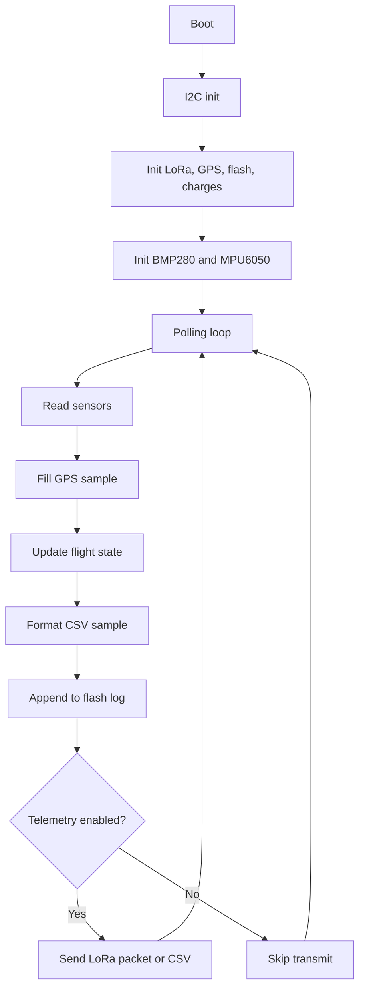

# System Architecture

## High-Level View

The firmware is organized as a polling loop in `src/main.cpp` that:

1. Initializes the hardware buses and drivers.
2. Reads sensor data from BMP280, MPU6050, and GPS.
3. Resolves the current flight state from altitude.
4. Logs each sample to external flash.
5. Sends telemetry over LoRa when enabled.

## Runtime Flow

## Core Modules

- `src/main.cpp`: orchestration and scheduling.
- `src/flight_state.cpp`: mission-state transitions.
- `src/flight_log.c`: persistent sample storage and CSV export.
- `src/telemetry.cpp`: LoRa packet encoding and CSV formatting.
- `src/charges.cpp`: GPIO output control for chute and reef charges.
- `src/bmp280.cpp`: altitude sensing from two BMP280 devices.
- `src/mpu6050.cpp`: inertial sensing from two MPU6050 devices.
- `src/gps.cpp`: Neo-6M parsing and GPS sample fill-in.
- `src/flash_memory.cpp`: SPI flash access.
- `src/lora.c`: UART-based LoRa driver.

## Control Philosophy

The current code is event-free and polling-based. There is no RTOS task split for sensing, telemetry, or recovery. That keeps the execution model simple, but it also means every subsystem must complete quickly enough not to stall the one-second loop cadence.
